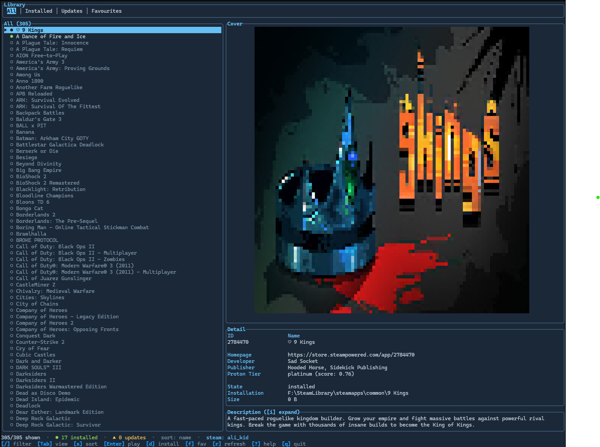

# Aurelia TUI

A terminal UI for browsing, installing, updating, and launching your Steam
library — powered by the [`aurelia`](https://crates.io/crates/aurelia)
command-line Steam launcher.

<p align="center">
  
</p>

## About

Aurelia TUI is a graphical front-end for the `aurelia` CLI. It is a rebuild of
[`steam-tui`](https://github.com/dmadisetti/steam-tui): where the original drove
`steamcmd` directly, Aurelia TUI shells out to the modern `aurelia` binary
(using its `--json` output for every backend operation) and lets it handle the
heavy lifting — authentication, library listing, downloads, and launching
(including Proton/Wine on Linux).

> [!NOTE]
> Steam no longer offers a backend-only mode, so a CLI-driven client like this
> is necessarily limited — but it stays useful if you'd rather not run the full
> Steam client.

## Requirements

- The [`aurelia`](https://github.com/Drackrath/Aurelia) CLI, **version `>= 0.1.11`**.
- A Steam account (logging in is described below).

Aurelia TUI looks for the `aurelia` binary in this order:

1. The `AURELIA_BIN` environment variable, if set (point it at a specific build).
2. A sibling `Aurelia` checkout next to this project
   (`../Aurelia/target/release/` or `.../debug/`) — handy when developing both.
3. `aurelia` on your `PATH`.

If none of these resolve, the sign-in screen tells you the binary couldn't be
found.

## Building

It's a standard Rust project:

```bash
cargo build --release
./target/release/aurelia-tui
```

Nix users can build via the included `flake.nix`.

## Usage

Launch `aurelia-tui` and you're off — the in-app help bar always shows the keys
for the current screen.

On startup it checks your session with `aurelia login --health --json` (which
reflects either a stored session or a running `aurelia` daemon). If you're
already signed in, it goes straight to your library.

### Signing in

If no session is found, you get a sign-in screen with two options:

- **`Enter` — username & password**, entered inside the TUI. If Steam Guard asks
  for a code, you type it on the next screen. The password is handed to `aurelia`
  through the `AURELIA_PASSWORD` environment variable so it never appears in the
  process list — but it is still typed into the TUI, so use QR if you'd rather it
  never be entered here at all.
- **`y` — QR code**, scanned with the Steam Mobile app. Nothing secret is typed
  anywhere; it shells out to `aurelia login --qr`.

Either path loads your library automatically once you authenticate. You can also
log in out-of-band with `aurelia login` in a terminal, then press `r` on the
sign-in screen to re-check the session.

### Browsing

The library is a single live browser: **filter tabs** across the top
(`All · Installed · Updates · Favourites`), the game list with **status badges**
(`●` installed, `▲` update, `⬇` downloading, `○` not installed, `♡` favourite),
a detail pane with cover art, and a **status bar** showing live counts, the
active filter/sort, and your account. Press `?` any time for the full key list.

#### Keys

| Key | Action |
| --- | --- |
| `j` / `↓`, `k` / `↑` | Move down / up (mouse wheel works too) |
| `g` / `G` | Jump to top / bottom |
| `PageUp` / `PageDown` | Page through the list |
| `Tab` / `Shift-Tab` | Cycle filter tabs |
| `1`–`4` | Jump straight to a tab |
| `/` | Focus the live fuzzy filter (type to narrow, `Esc` clears) |
| `s` | Cycle sort (name / installed-first) |
| `Enter` | Launch the selected game (`aurelia play`) |
| `i` | Expand / collapse the description panel |
| `d` | Install / download the selected game |
| `f` | Toggle the game as a favourite |
| `H` | Hide the selected game |
| `r` | Refresh the library from Steam |
| `l` | Sign in again |
| `?` | Toggle the help overlay |
| `q` | Quit |

Selecting a game fetches its details lazily — developer/publisher metadata
(`aurelia info`), the ProtonDB compatibility tier, and cover art all load in the
background, so navigation stays responsive while they fill in.

## Features not in the help

A little Easter egg for reading the documentation.

### Favourites

`f` toggles a favourite (shown with a ♡), and `F` filters the list down to just
your favourites.

### Hiding games

`H` hides the selected game. Hidden games are recorded in
`~/.config/aurelia-tui/config.json`.

### Showing other app types (demos, tools, …)

By default only `Game` and `DLC` entries are shown. Edit the `allowed_games`
field in the config to include any of `Game`, `DLC`, `Driver`, `Application`,
`Config`, `Demo`, `Tool`, or `Unknown`.

## Configuration & data

| Path | Contents | Override |
| --- | --- | --- |
| `~/.config/aurelia-tui/` | `config.json` (favourites, hidden games, allowed types, highlight colour) | `AURELIA_TUI_DIR` |
| `~/.cache/aurelia-tui/` | cached library (`games.json`) | `AURELIA_TUI_CACHE_DIR` |
| `~/.cache/aurelia-tui/icons/` | cached cover art | `AURELIA_TUI_ICON_DIR` |

Launching, Proton/Wine, and runtime concerns are all handled by `aurelia play`,
so there are no wrapper scripts or separate runtimes to manage on your side.

## Missing features

- Filter for only showing installed games.

## Credits

- [steam-tui](https://github.com/dmadisetti/steam-tui) — the original client this
  is rebuilt from, by [@dmadisetti](https://github.com/dmadisetti) and contributors
- [aurelia](https://crates.io/crates/aurelia) — the CLI backend
- [steam-vent](https://codeberg.org/steam-vent/steam-vent) — Steam protocol implementation

## License

Distributed under GPL-3.0. See [`LICENSE`](LICENSE) for details.
